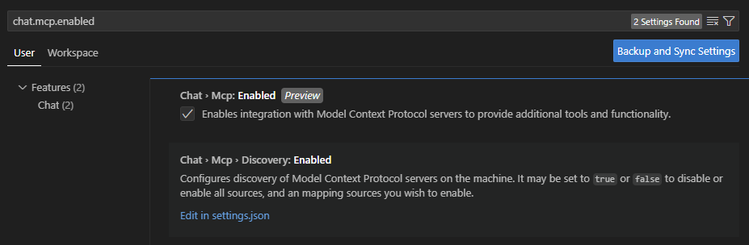
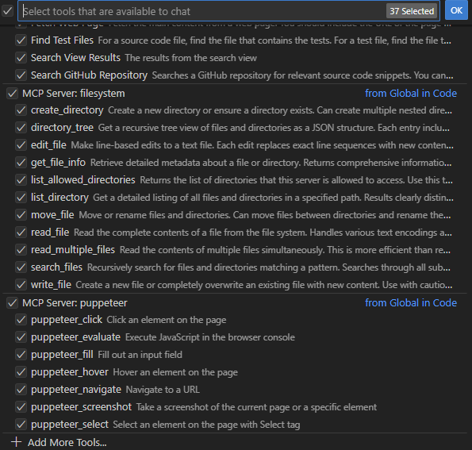
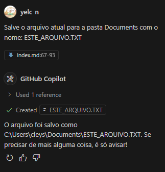
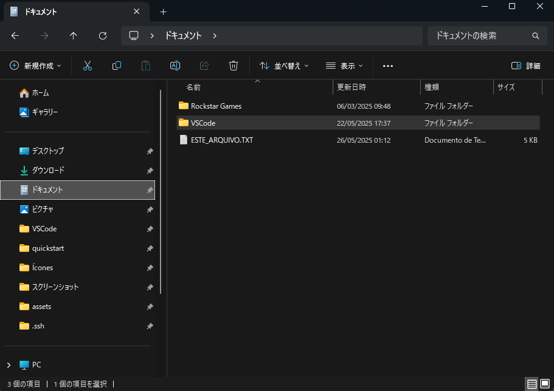

+++
date = '2025-05-26T00:41:11+09:00'
draft = true
title = 'Servidores MCP'
tags = ["ia"]
# series = ["Contos de Sapo"]
# series_order = 2
showComments = true
heroStyle = "thumbAndBackground"
+++

## MCP? Servidor?
Um servidor MCP (Model Context Protocol) é um componente essencial que permite a modelos de linguagem, como o Claude, interagirem com dados e ferramentas externas de forma padronizada e segura. Introduzido pela Anthropic em novembro de 2024, o MCP estabelece um protocolo aberto que conecta modelos de IA a fontes de dados, APIs, arquivos locais e outros recursos, ampliando significativamente suas capacidades além da simples geração de texto.

Na prática, o servidor MCP atua como uma ponte entre o modelo de IA e o mundo externo, fornecendo:

* **Ferramentas**: ações que a IA pode executar, como chamadas de API ou comandos de terminal.
* **Recursos**: dados que a IA pode acessar, como arquivos ou entradas de banco de dados.
* **Prompts**: modelos de interação que orientam o comportamento da IA em cenários específicos.

Essa arquitetura permite que a IA realize tarefas complexas, como editar arquivos, consultar bancos de dados ou interagir com serviços como GitHub e Slack, tudo dentro de um ecossistema seguro e modular. A padronização proporcionada pelo MCP facilita a integração e reutilização de ferramentas, promovendo um desenvolvimento mais eficiente e colaborativo no campo da inteligência artificial.

## Usando com o VS Code
Existem varias formas de se usar os servidores MCP mas falarei de 2: como usar com o Claude for Desktop e com o VS Code.

### VS Code
Tudo esta explicado [aqui](https://code.visualstudio.com/docs/copilot/chat/mcp-servers?wt.md_id=AZ-MVP-5004796) mas vou dar uma versao resumida.

1. Deve-se atulizar o VS Code para a versao mais nova.
2. Faca os procedimentos para usar o Github Copilot se ainda nao o tiver feito.
3. Abra as configuracoes e procure por "chat.mcp.enabled" > Clique no checkbox enable para permitir o uso.

4. Vamos adicionar um servidor MCP como configuracao de usuario (configuracao global)
    1. Ainda em configuracoes procure por "mcp" e clique em "edit settings.json" 
    2. [No github oficial](https://github.com/modelcontextprotocol/servers?tab=readme-ov-file) pegue as configuracoes do servidor que deseja usar (neste exemplo usaremos o file system)
    3. [Abra a pagina do servidor](https://github.com/modelcontextprotocol/servers/tree/main/src/filesystem) e procure por "Usage with Vs Code" e escolha se quer usar com docker ou NPM.
    4. Usarei NPM para este exemplo entao tambem e necessaria a instalacao do Node JS.
    5. Copie o conteudo dentro do espaco "NPX" para seu arquivo mcp nas configuracoes.
    6. Reinicie o VS Code.
    7. Exemplo de configuracao que usa file system para salvar e ler arquivos locais e puppeteer para controle de navegador:
    ```
    {
    "redhat.telemetry.enabled": false,
    "chat.editing.alwaysSaveWithGeneratedChanges": true,
    "git.openRepositoryInParentFolders": "never",
    "workbench.startupEditor": "none",
    "editor.accessibilitySupport": "off",
    "explorer.confirmDelete": false,
    "explorer.confirmDragAndDrop": false,
    "mcp": {
    
        "inputs": [],
        "servers": {
            "mcp-server-time": {
                "command": "python",
                "args": [
                    "-m",
                    "mcp_server_time",
                    "--local-timezone=America/Los_Angeles"
                ],
                "env": {}
            },
            "filesystem": {
                "command": "npx",
                "args": [
                    "-y",
                    "@modelcontextprotocol/server-filesystem",
                    "C:\\Users\\<SEU_USUARIO>\\Documents"
                    // aqui vc adiciona quais diretorios quer dar acesso para a IA
                ]
            },
            "puppeteer": {
                "command": "npx",
                "args": [
                    "-y",
                    "@modelcontextprotocol/server-puppeteer",
                    "--browser=chrome",
                    "--headless=false"
                ],
                "env": {
                    "PUPPETERR_LAUNCHER_OPTIONS": "\"defaultViewport\": {\"width\": 1920, \"height\": 1080}"
                    }
                }
            }
        }
    }
    ```
5. Para usar os servidores e so iniciar um chat com o Copilot usando **CRTL+SHIFT+I**.
6. Use **CRTL+SHIFT+/** dentro do chat para confirmar quais ferramentas estao instaladas.

7. Na sua prompt esclareca a IA qual ferramenta usar. 
    Ex: "Use File System" ou "Salve o arquivo na pasta X"
8. Teste:


<small>*Desculpa, esta em japones*</small>

## Final
Mais a frente vou atualizar com mais formas de se usar os servidores MCP.
Ate a proxima atualizacao!