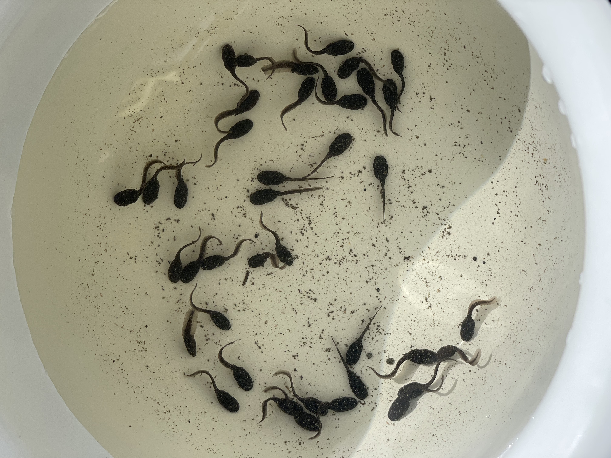
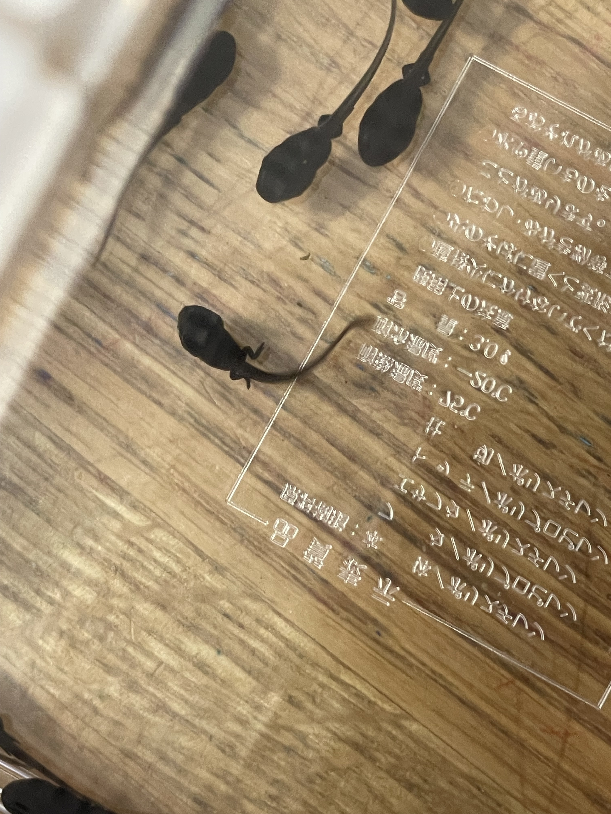
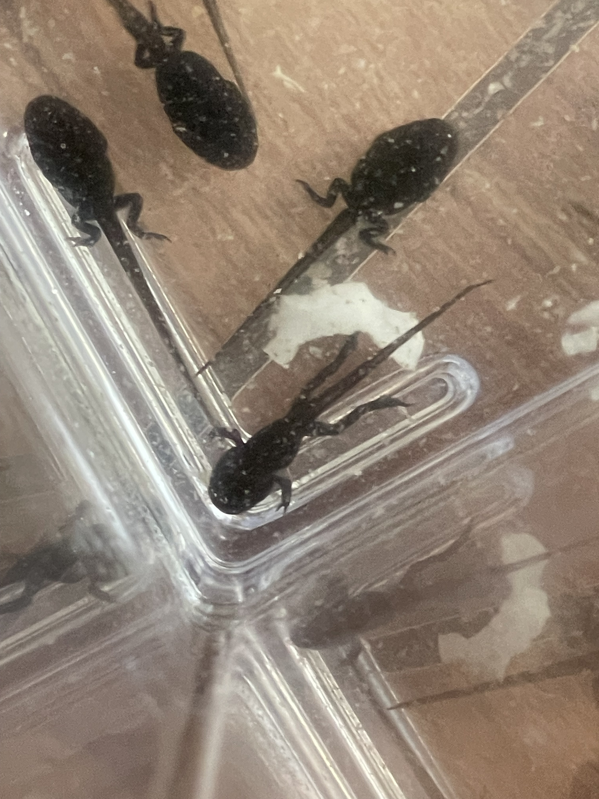
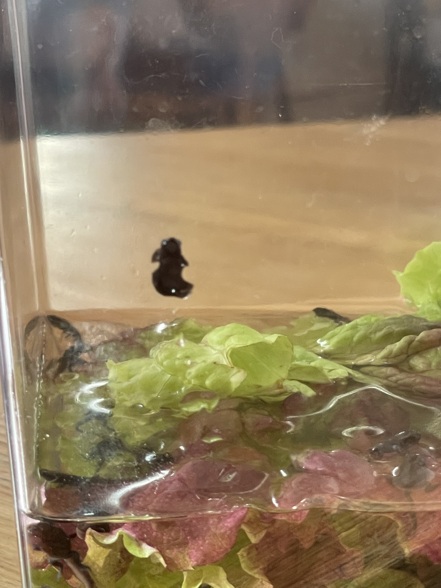
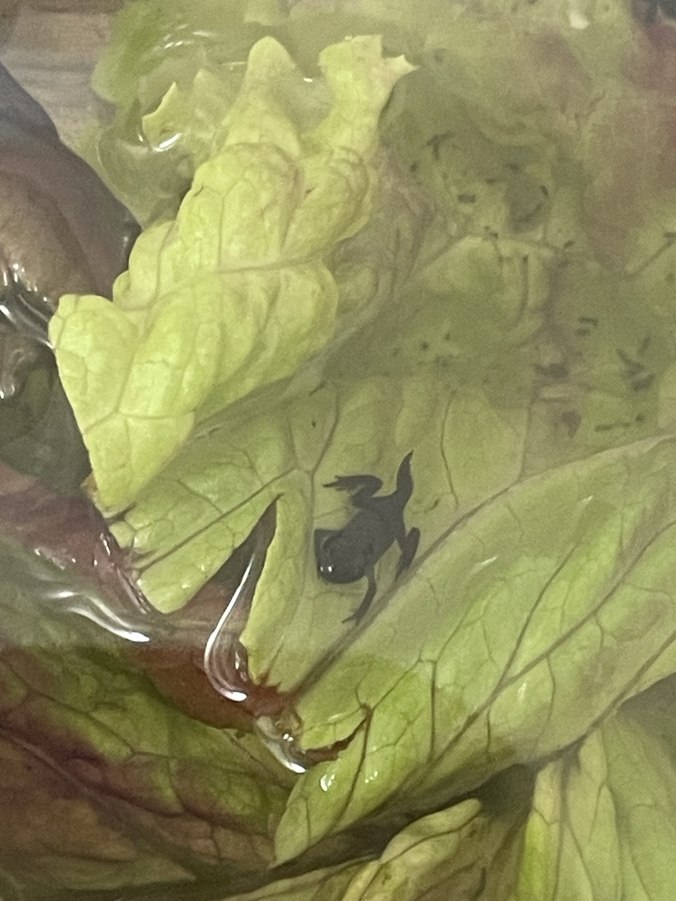
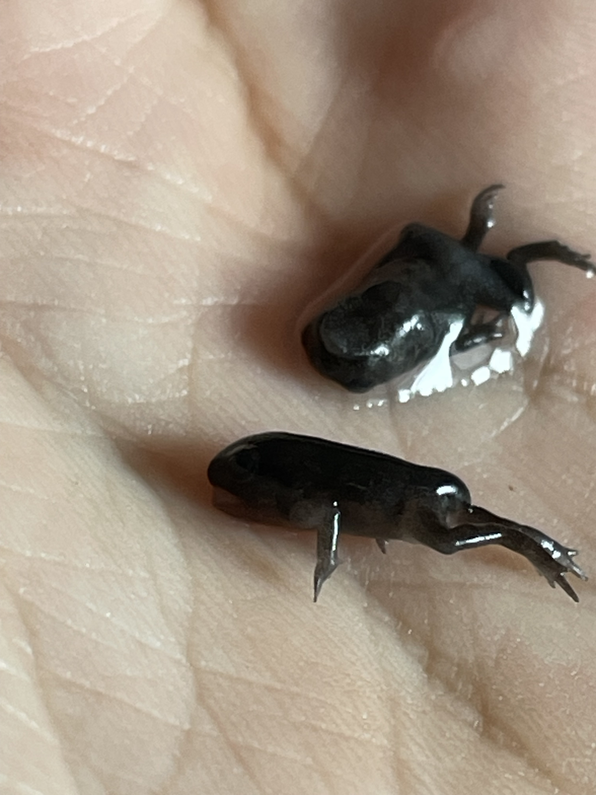
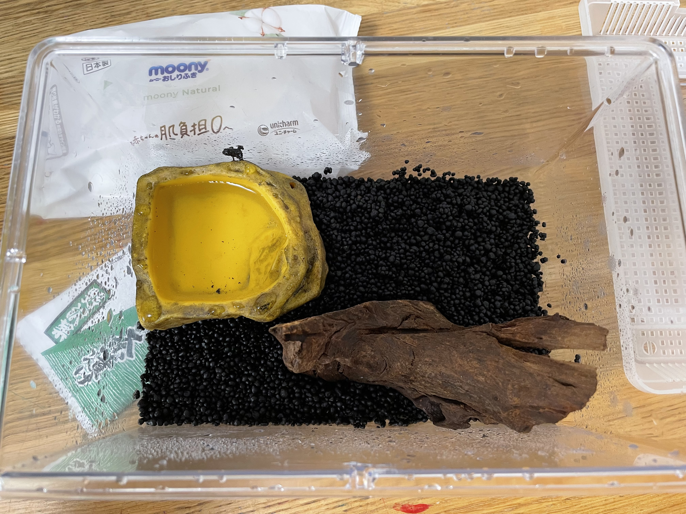

+++
date = '2025-05-19T10:00:00+09:00'
lastmod = '2025-05-22T17:56:00+09:00'
draft = false
title = 'Por que o sapo não lava o pé?'
tags = ["sapo", "cotidiano"]
series = ["Contos de Sapo"]
series_order = 1
showComments = true
showHero = true
heroStyle = "thumbAndBackground"
+++
### Mas por que sapos?
Minha filha frequenta uma escola que não tem paredes. 
A escola é dentro da floresta. 
O objetivo da escola é reascender a conecção dos humanos com a natureza.
Dentro das atividades escolares as crianças sobem árvores, entram em rios/lagos e por aí vai.

Desta vez minha filha trouxe um tanto de girinos para casa.
Me lembro de ter conversado com ela que se ela conseguisse pegar algum, poderia trazer para casa.
Mas a quantidade que ela trouxe me supreendeu.

<small>*O que farei com tanto girino?*</small>

---
### Um pouco sobre a escola
A escola se chama にっこにこ幼稚園 (nicconico youchien) que significa Jardim de Infância Nicconico.
A ideia da escola é reconectar as crianças com a natureza e as ensinar a sobreviver na natureza.
Minha esposa e eu conversamos bastante sobre o futuro de nossos filhos e decidimos criar em um ambiente mais "natural". A tecnologia pode ser aprendida depois de mais velha e sinceramente,não é uma habilidade necessaria para uma criança, mas sobreviver na natureza é algo importante para o agora. Por isso decidimos nesta pré escola.

  <a href="https://www.instagram.com/2525moriyochien/" target="_blank" style="text-decoration: none; font-weight: bold; font-size: 16px;">
    📸 Instagram da escola: @2525moriyochien
  </a>

 

<small>*Vídeo em japônes sobre a escola:*</small>

  <iframe
    src="https://www.youtube.com/embed/ChuhwAl3vsQ?si=--ut6Ya9wM3LR8sM"
    frameborder="0"
    allow="accelerometer; autoplay; clipboard-write; encrypted-media; gyroscope; picture-in-picture"
    allowfullscreen
    style="position: absolute; top: 0; left: 0; width: 100%; height: 100%; border-radius: 20px;">
  </iframe>

---
### E como se cria sapos?
Bem, após conversarmos em fámilia sobre os girinos, decidimos cuidar deles até desenvolverem as pernas. Após perquisar sobre criação de girinos (o que aparentemente é algo popular), descobri alguns aspectos interessantes:
- Girinos são onívoros (comem de tudo, até outros girinos!)
- Girinos quando novos, respiram por brânquias externas (guelras)
- Quando eles desenvolvem um pouco e as pernas traseiras crescem, as guelras externas desaparecem e as guelras internas nascem. Também desenvolvem respiração cutânea.
- Quando as pernas dianteiras nascem, as guelras somem e eles começam a desenvolver pulmões.
- Assim que o rabo diminui para mais ou menos metade de seu tamanho original, eles começam a se preparar para a vida fora da água e mudam para respiração pulmonar.
- Sua pele é muito frágil e só de contato com a pele humana (36 graus) eles sofrem queimaduras.
- Por sua pele ser frágil, a troca de água é feita 1 vez a cada 3~4 dias.

---
### Está indo tudo bem?
Após dar somente grãos de arroz para eles comerem, as pernas traseiras nasceram.

<small>*Eles são até bonitinhos.*</small>

Após 3 girinos desenvolverem as pernas dianteiras, decidimos dar várias folhas de alface para eles comerem e esperamos **3 dias.**

<small>*Deixar a comida sempre à disposição deixou a água cheia de totô...*</small>

---
### Situação final
Mas infelizmente acabei deixando eles na água por tempo demais e 6 girinos quase sapos faleceram...

<small>*Minha filha não ficou abalada mas eu fiquei.*</small>

Então decidi procurar mais informações e mudei o ambiente que os quase-sapos moram.

<small>*Com direito a um pedaço de árvore para escalarem.*</small>

Sapos são carnívoros desde pequenos por isso o próximo passo será comprar larvas para que eles possam comer.

Até a próxima atualização!