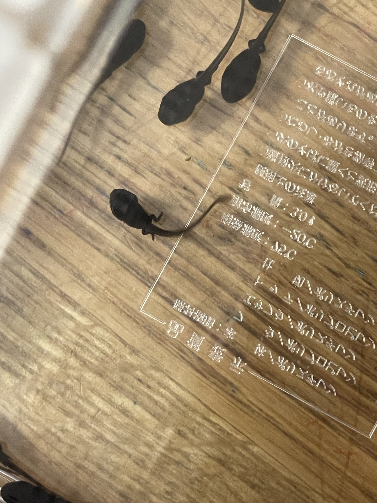
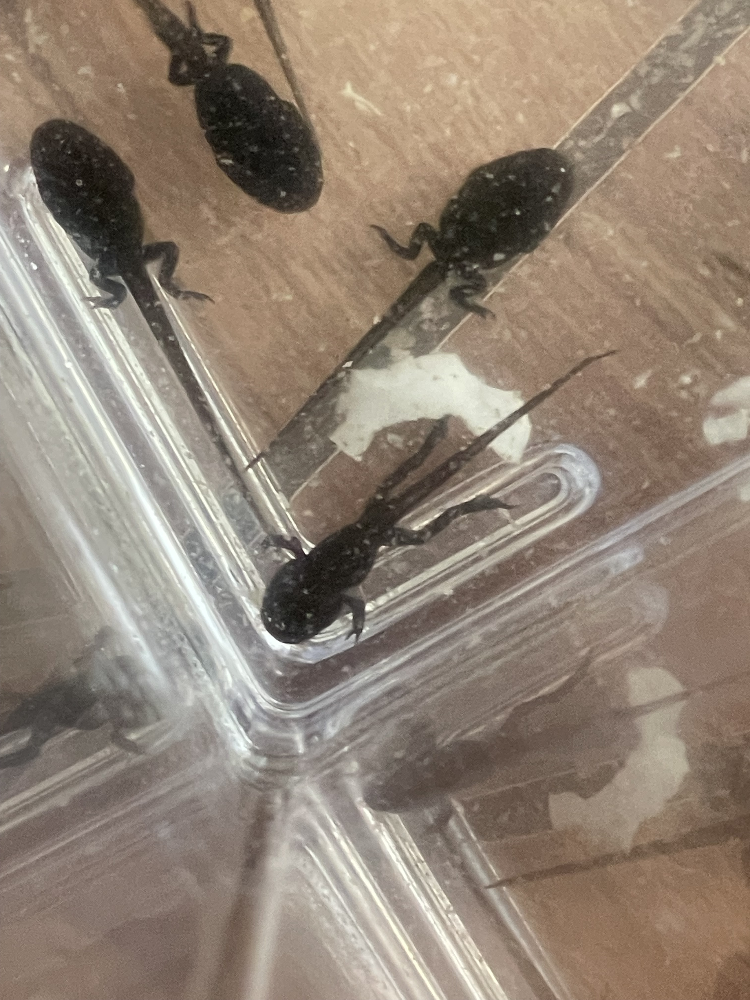
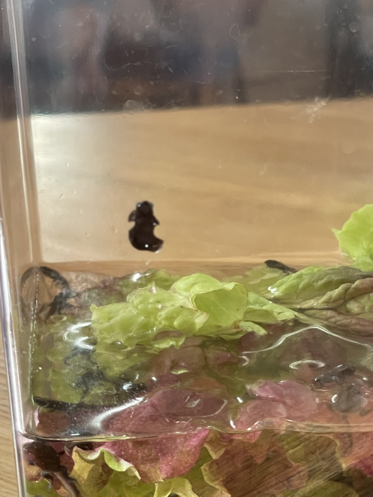
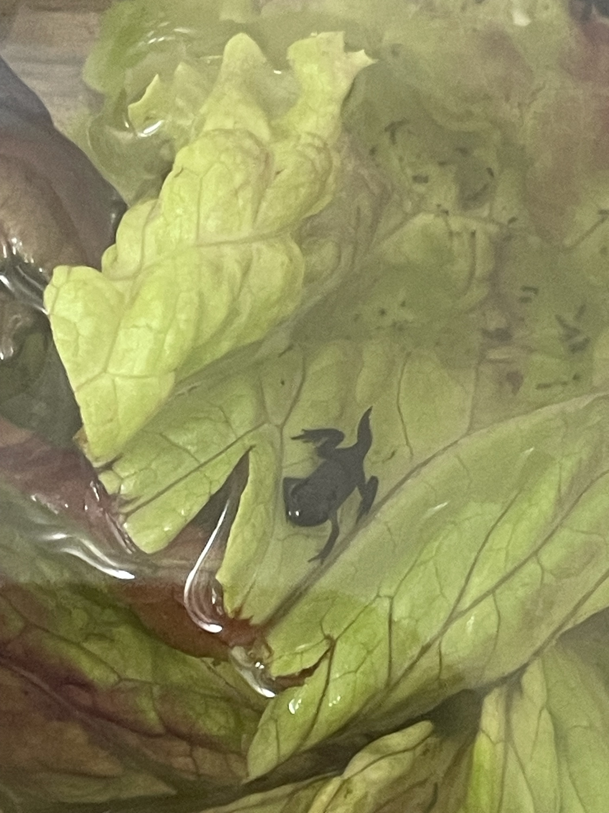
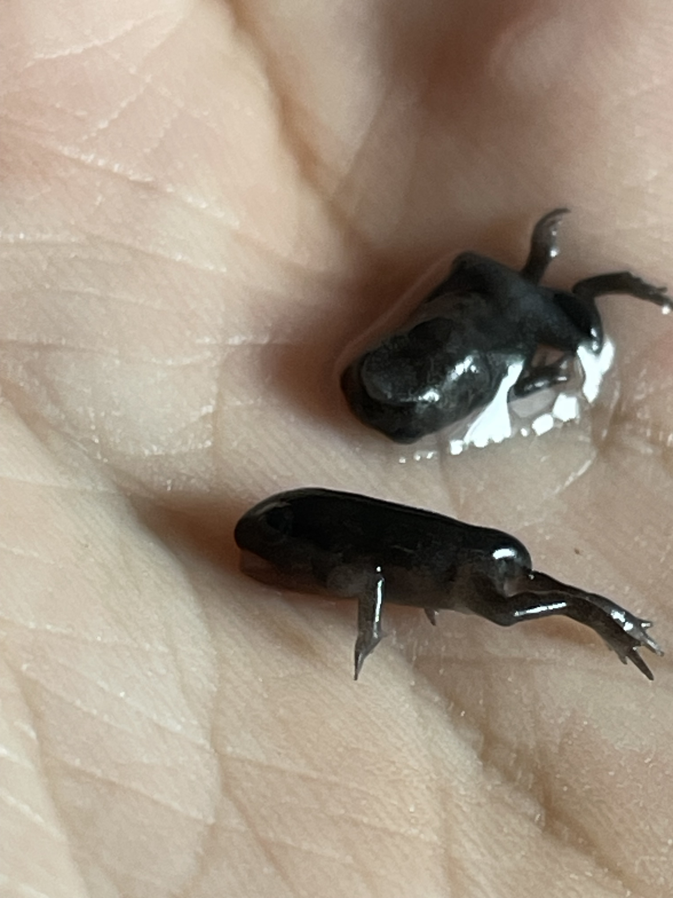

+++
date = '2025-05-19T10:00:00+09:00'
lastmod = '2025-05-20T11:38:00+09:00'
draft = false
title = 'Por que o sapo não lava o pé?'
authors = ["cley"]
tags = ["sapo", "cotidiano"]
series = ["Sapos"]
series_order = 1
+++
### Mas por que sapos?
Minha filha frequenta uma escola que não tem paredes. 
A escola é dentro da floresta. 
O objetivo da escola é reascender a conecção dos humanos com a natureza.
Dentro das atividades escolares as crianças sobem árvores, entram em rios/lagos e por aí vai.

Desta vez minha filha trouxe um tanto de girinos para casa.
Me lembro de ter conversado com ela que se ela conseguisse pegar algum, poderia trazer para casa.
Mas a quantidade que ela trouxe me supreendeu.

<small>*O que farei com tanto girino?*</small>

---
### E como se cria sapos?
Bem, após conversarmos em fámilia sobre os girinos, decidimos cuidar deles até desenvolverem as pernas. Após perquisar sobre criação de girinos (o que aparentemente é algo popular), descobri alguns aspectos interessantes:
- Girinos são onívoros (comem de tudo, até outros girinos!)
- Girinos quando novos, respiram por brânquias externas (guelras)
- Quando eles desenvolvem um pouco e as pernas traseiras crescem, as guelras externas desaparecem e as guelras internas nascem. Também desenvolvem respiração cutânea.
- Quando as pernas dianteiras nascem, as guelras somem e eles começam a desenvolver pulmões.
- Assim que o rabo diminui para mais ou menos metade de seu tamanho original, eles começam a se preparar para a vida fora da água e mudam para respiração pulmonar.
- Sua pele é muito frágil e só de contato com a pele humana (36 graus) eles sofrem queimaduras.
- Por sua pele ser frágil, a troca de água é feita 1 vez a cada 3~4 dias.

---
### Está indo tudo bem?
Após dar somente grãos de arroz para eles comerem, as pernas traseiras nasceram.

<small>*Eles são até bonitinhos.*</small>

Após 3 girinos desenvolverem as pernas dianteiras, decidimos dar várias folhas de alface para eles comerem e esperamos **3 dias.**

<small>*Deixar a comida sempre à disposição deixou a água cheia de totô...*</small>

---
### Situação final
Mas infelizmente acabei deixando eles na água por tempo demais e 6 girinos quase sapos faleceram...

<small>*Minha filha não ficou abalada mas eu fiquei.*</small>

Então decidi procurar mais informações e mudei o ambiente que os quase-sapos moram.

<small>*Com direito a um pedaço de árvore para escalarem.*</small>

Sapos são carnívoros desde pequenos por isso o próximo passo será comprar larvas para que eles possam comer.

Até a próxima atualização!