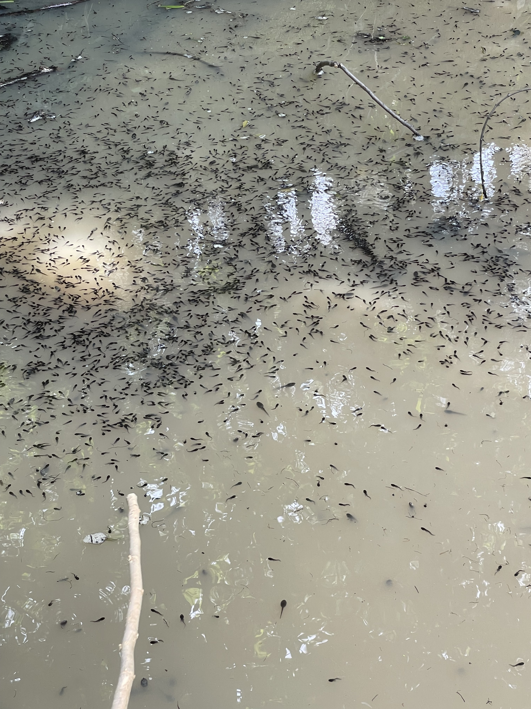
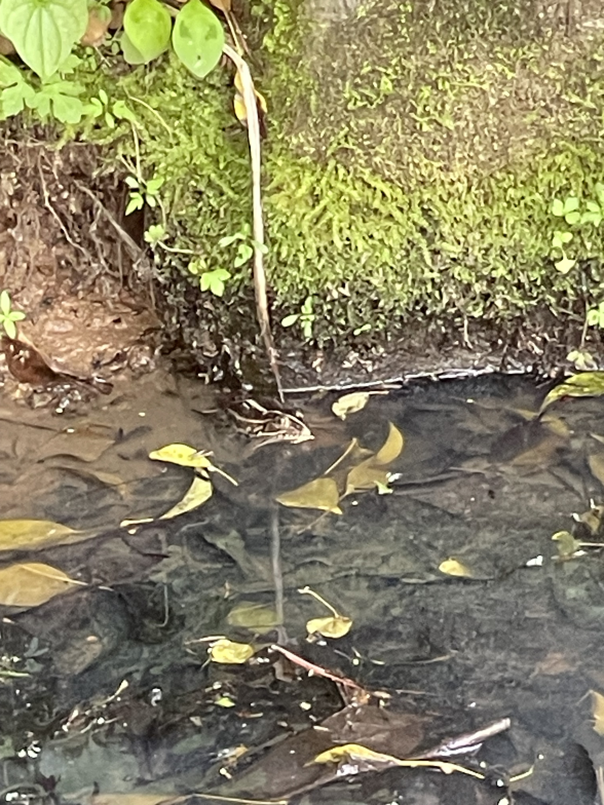

+++
date = '2025-05-21T17:43:34+09:00'
# lastmod = '2025-05-20T11:38:00+09:00'
draft = true
title = 'Porque ele mora na lagoa!'
tags = ["sapo", "cotidiano"]
series = ["Contos de Sapo"]
series_order = 2
showComments = true
heroStyle = "thumbAndBackground"
+++

## Visita a sapolandia

Hoje fui buscar minha filha no jardim de infancia e aproveitei a oportunidade para passar no lago onde minha filha pegou os girinos. Neste lago existia mais girinos que folhas caidas... Devia ter mais girinos que moleculas de H2O. Fiquei realmente surpreendido e quase entrei na agua com minha filha. (Deixo sempre um par de botas de borracha cano longo no carro) 
So nao entrei pela falta de roupa para trocar, caso o lago fosse fundo e sujasse minha calca. 

<small>*Quanto girino!!!!*</small>

Ao continuar brincando encontrei um sapo adulto e tentei tirar uma foto mas como ele estava longe (usei zoom 10x) a foto nao ficou tao boa....

<small>*Tenta achar ele na imagem...hehe*</small>

Como da pra ver na imagem dos girinos no lago, tem girinos grandes e girinos pequenos vivendo juntos. Acredito que sao especies diferentes de sapos que vem deixar os ovos neste lago.  
Tambem estou com um pouco de medo pois ainda nao consegui dar nada de comer para os sapos aqui em casa.... Tinha 7 sapos vivos mas hoje nao somente achei 5, os outros 2 estao escondidos talvez? 
Eu nao sei e tambem nao sei se sapos tem a capacidade ou a necessidade de se enterrar.  

Tomara que eles fiquem vivos. Nao gostaria de perder os sapinhos. Tentar criar 7 e perder 100% deles seria triste. 

Vou deixar este video aqui que foi bem interessante sobre o ciclo de vida de um sapo.

  <iframe
    src="https://www.youtube.com/embed/QhAaEuMe39s?si=_rSgQOHq7aA3AOmZ"
    frameborder="0"
    allow="accelerometer; autoplay; clipboard-write; encrypted-media; gyroscope; picture-in-picture"
    allowfullscreen
    style="position: absolute; top: 0; left: 0; width: 100%; height: 100%; border-radius: 20px;">
  </iframe>

Valeu e ate a proxima!